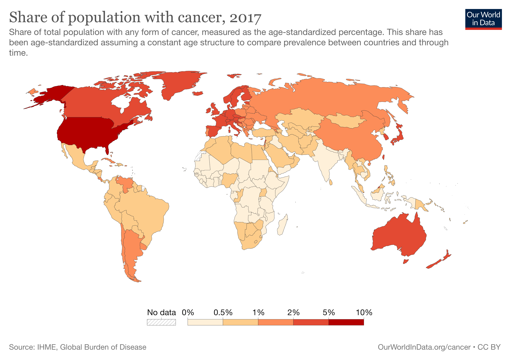
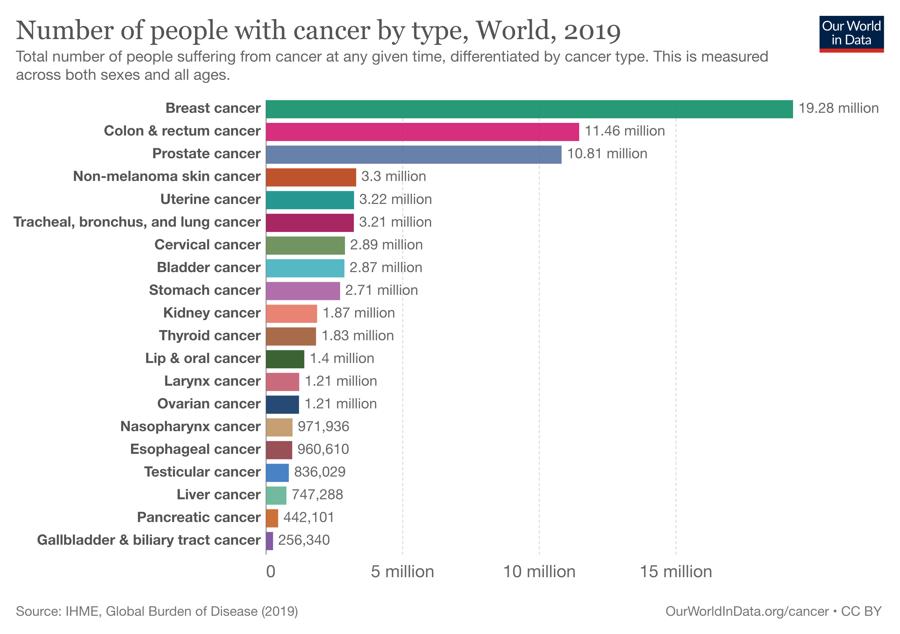
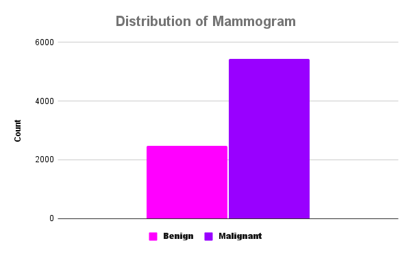

# Breast Cancer Detection

## Overview

Cancer is a disease that happens when cells grow and multiply uncontrollably. There are more than 100 different types of cancer. Breast cancer happens when cells in a person's breast tissue start growing out of control. Cancer can be very deadly - some cancers have a 5 year survival rate of less than 10%, while others have 5 year survival rate of over 90%. Breast Cancer in particular has a 5 year survival rate of over 90% when it is diagnosed very early - in stage 0 or stage 1. This survival rate falls to 22% if is diagnosed late - when the cancer has spread to other organs stage 4.

What's interesting is the fact that cancer is more prevalent in developed countries.

## Business Understanding

Cancer is very prevalent in the US - we have the highest incidence rating in the developed world. Cancer is the second leading cause of death in the United States. It is responsible for more than 1 in 4 deaths. More than 1.6 million Americans have been diagnosed with cancer each year since 2016. As of 2019, there were more than 16,000,000 Americans living with some form of cancer.

Breast Cancer is the most prevalent cancer in the world. There are some 19 million people living with breast cancer. And looking at research - we know that early diagnosis and treatment lead to better survival odds. Out of the more than 100 cancers - we typically only screen for 4 - 6 cancers - depending on what country you live in. These cancers are: breast, prostate, cervical, lung, colorectal, and skin cancer. 

The tool that is the current gold standard for breast cancer screening is a mammogram.

Mammograms are recommended every year or two based a person's risk factors.

However mammograms arent perfect. They have a false positive rate of anywhere from 10-20% - according to several studies. They also have a false negative rate of about 15%. 

These error rates are increased for women who have dense breast tissue, are younger, and are women of color. 

The goal of this project is to develop a machine learning classification algorithmn for the National Institues of health that is more reliable at finding instances of breast cancer and also mimimzing the false negative and false positive rates.

## Data Understanding

The data for this project comes from the BreakHis dataset on Kaggle. It contains 7,909 images - of which 2480 are benign (no cancer) and 5429 are malignant (cancer). ["Kaggle"](https://www.kaggle.com/datasets/ambarish/breakhis). This images were collected from "82 patients using different magnifying factors (40X, 100X, 200X, and 400X)". Approximately 70% of the images in our dataset were malignant. 

## Modeling and Results
In this project, I was trying to build a model that would do better than the current accepted error rates - the False Positive rate of 10-20% and the False Negative rate of 15%. I built several models to make the classification. I trained the models with training data and validated using the validation data. 

Based on the validation metrics - I chose the model that had the best overall metrics and ran it with the test data. I built 8 models- including the dummy model. Unfortunately - the results I achieved werent great- I wasnt able to hit 85% on any of my metrics - accuracy, precision, or recall.

## Conclusion & Next Steps
In conclusion, my best model did not do well at classifying images as benign or malignant. 

As for potential next steps, these images were taken from a pretty small sample of people - 82 patients. There was no accompanying clinical information - did the patient have dense breast tissue, and if they had cancer - what stage was the image from, what specific type of breast cancer. There was also no demographic information provided.

Increasing the sample size to a number that is significant and providing some demographic and clinical information could lead to better results.

Also there is some research to suggest that there are other ways that would be more accurate at diagnosing breast cancer - using MRIS, cell free DNA and cell tumor DNA seem to hold some promise as well.

## For More Information

See the full analysis in the [Jupyter Notebook](modeling_notebook.ipynb) or review [this presentation](presentation.pdf).

For additional info, contact Ogo Ndugba

-ogo.ndugba@gmail.com
-www.linkedin.com/in/ogo-ndugba
-github.com/ondugba

## Repository Contents
- images/
- Data/
- .gitignore
- LICENSE.md
- modeling_notebook.ipynb
- README.md
